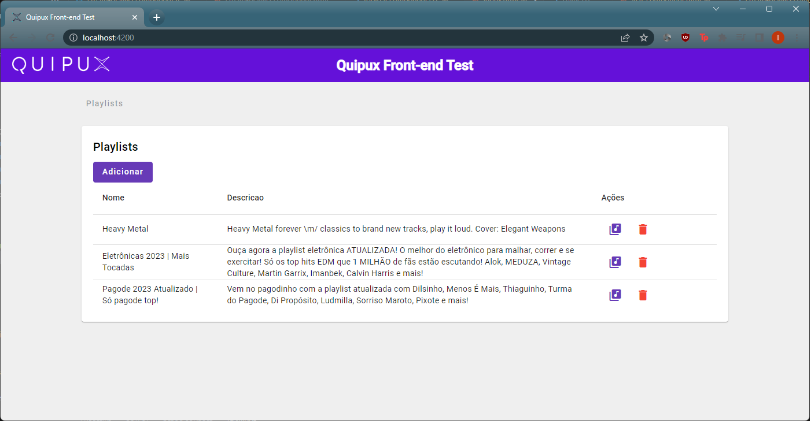
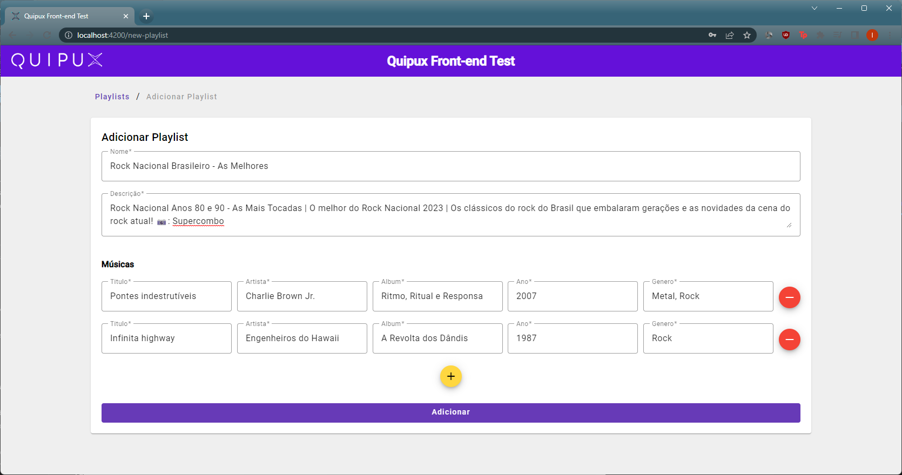
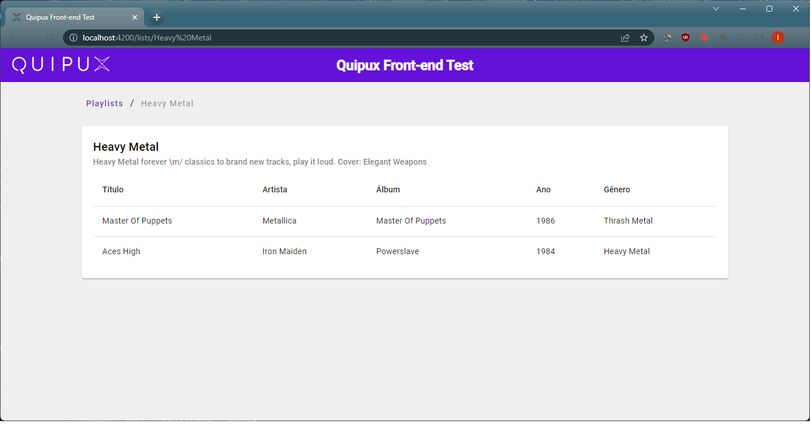

# QuipuxFrontendTest

## Descrição do teste

Implementar um projeto  (Angular, Vue, Jsf, etc) no qual exiba formulários que permitam interagir com as APIs criadas no exercicio anterior.

## Prints

